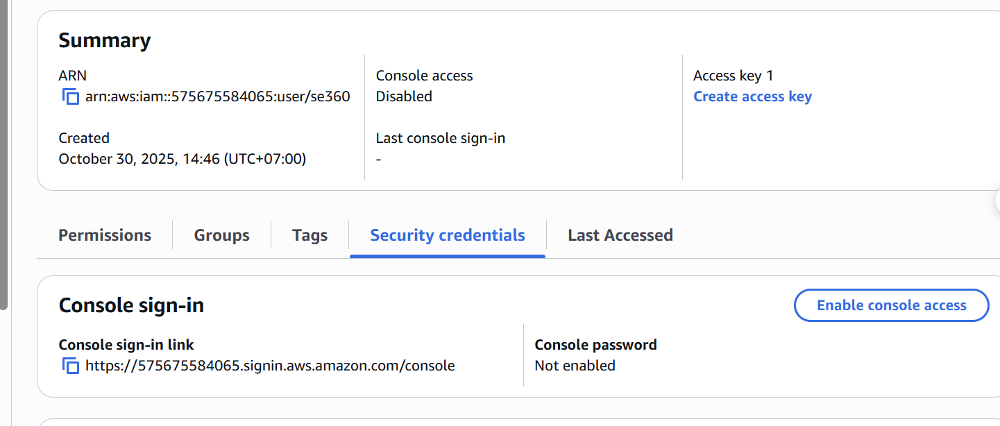
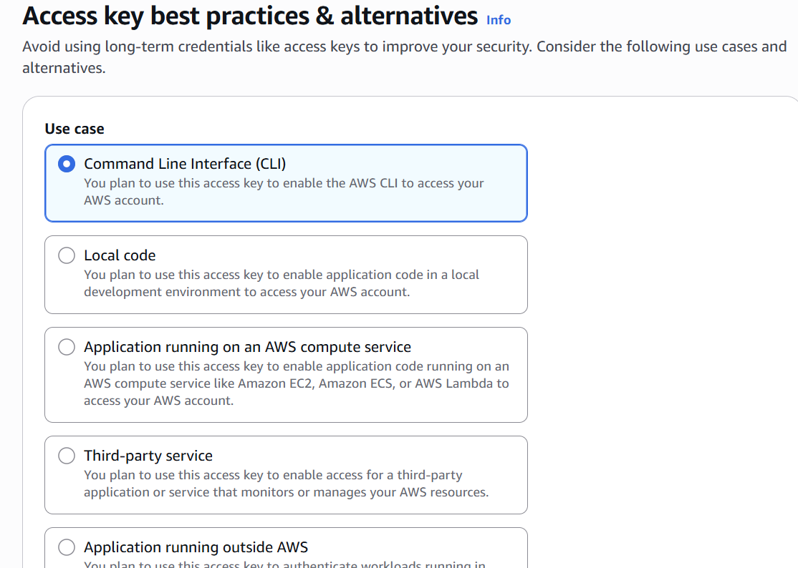
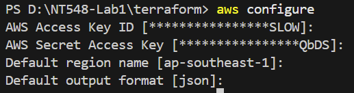

# NT548.Q11 - Lab 1
## Group 09
|    MSSV   |      Họ và tên     | Công việc      |
|-----------|--------------------|-------------   |
|  23520797 | Lê Trung Kiên      | CloudFormation |
|  23521588 | Trần Thị Thùy Tiên | CloudFormation |
|  23521471 | Trần Thuận Thến    | Terraform      |
|  23521564 | Trần Lê Uyên Thy   | Terraform      |
## Yêu cầu:
- Các dịch vụ phải được viết dưới dạng module.
- Phải đảm bảo an toàn bảo mật cho EC2 (thiết lập Security Groups).
- Kết quả:
  - Báo cáo Word (theo mẫu đi kèm ở dưới).
  - Link GitHub (source code và file README hướng dẫn cách chạy mã nguồn).
## Lưu ý:
- Sinh viên cần thường xuyên cập nhật mã nguồn lên GitHub.
- Phải có các test cases để kiểm tra từng dịch vụ được triển khai thành công.
## Báo cáo
### 1. Terraform
## Setup Instructions:
### 1. Tạo IAM user <a name="create-iam-user"></a>
- Tới phần IAM section ở AWS Management Console

- Bên trái panel, chọn Users

- Tạo user sau đố nhập tên mình tự đặt

- Chọn attach the necessary policies. Dưới phần Permissions policies, chọn AdministratorAcess để cho phép Terraform có đầy đủ quyền quản lý các tài nguyên.

- Click vào user mình vừa tạo và tới trang ``Security Credentials``

- Kéo xuống ``Access keys``, và chọn ``Create access key``

- Ở phần use case, chọn ``CLI``, tick vào ô ``I understand the above recommendation and want to proceed to create an access key.``

- Sau khi tạo xong access keys, chúng ta có thể tải file CSV để lưu keys hoặc copy trực tiếp (secret access key chỉ hiện thị một lần duy nhất)


### 2. Run Terraform<a name="run-terraform"></a>
- Clone the repo
```bash
https://github.com/TrThuyTien/NT548-Lab1
cd terraform
```

- Ở terminal, configure tài khoản AWS
```bash
aws configure
```


- Khởi động Terraform
```bash
terraform init
```

- Đảm bảo rằng syntax và cấu trúc đều đúng
```bash
terraform validate
```

- Xem trước những tài nguyên nào mà Terraform sẽ tạo, chỉnh sửa hoặc xóa

```bash
terraform plan
```

- Áp dụng
```bash
terraform apply
```
### 2. CloudFormation
## QUY TẮC LÀM VIỆC TRÊN GITHUB
- Trước khi bắt đầu làm, đọc kĩ quy trình làm việc với Git & GitHub [tại đây](https://www.figma.com/board/sAU9OhFxPQCTKGghPKQqbF/Quy-tr%C3%ACnh-Git-%26-GitHub?node-id=0-1&t=GYFBeSfRyeSQG1Zb-1).
- Ghi rõ nội dung commit
- Chỉ commit khi hoàn thành 1 feature/ bug nào đó, không commit khi đang làm dở, không commit dồn.
- Khi muốn task/feature merge vào main, tạo pull request (đã cài Protection rules), sau đó nhờ một bạn trong nhóm review code và approve pull request.
- Xóa nhánh khi merge thành công.
